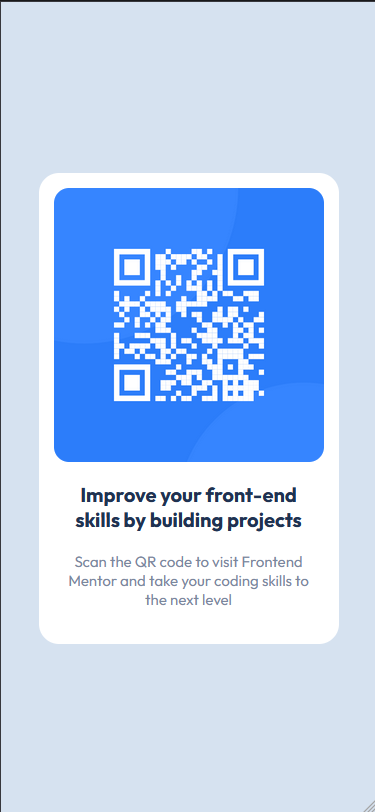

# Frontend Mentor - QR code component solution

## Table of contents

- [Overview](#overview)
  - [Screenshot](#screenshot)
  - [Links](#links)
- [My process](#my-process)
  - [Built with](#built-with)
  - [What I learned](#what-i-learned)
  - [Continued development](#continued-development)
  - [Useful resources](#useful-resources)
- [Author](#author)
- [Acknowledgments](#acknowledgments)

## Overview

### Screenshot

<p>- Mobile Version</p>
 


<p>- Desktop Version</p>


### Links

- Solution URL: [https://www.frontendmentor.io/solutions/qr-code-component-with-flexbox-hxJ-Dqtov-](https://www.frontendmentor.io/solutions/qr-code-component-with-flexbox-hxJ-Dqtov-)
- Live Site URL: [https://g4breela.github.io/projeto-qr-code/index.html](https://g4breela.github.io/projeto-qr-code/index.html)

## My process

### Built with

- Tags semânticas do HTML5
- Propriedades personalizadas CSS
- Flexbox
- Mobile-first


### What I learned

Para evitar a redundância de propriedades, desenvolvi uma classe personalizada que aplica configurações flexíveis aos elementos.

```css
.flex{
      display: flex;
      flex-direction: column;
      justify-content: center;
      align-items: center;
    }
```

### Continued development

Tenho a intenção de aprimorar continuamente minhas habilidades com o conceito mobile-first, incorporando media queries para tornar meus projetos mais responsivos e adaptáveis de acordo com a largura dos dispositivos.

### Useful resources

- [MDN Web Docs](https://developer.mozilla.org/en-US/docs/Web/CSS) - Utilizei bastante a documentação da MDN para pesquisar propriedades do css e aplica-las corretamente no meu código.


## Author

- Website - [Add your name here](https://github.com/G4breela)
- Frontend Mentor - [@G4breela](https://www.frontendmentor.io/profile/G4breela)
- Likedlin- [@yourusername](https://www.linkedin.com/in/gs-silva01/)


## Acknowledgments

Com os conhecimentos adquiridos no Curso em Vídeo, enfrentei este desafio com facilidade e eficiência. Agradeço profundamente ao Professor Guanabara por oferecer cursos tão abrangentes.

Expresso minha gratidão ao Frontend Mentor por nos incentivar a persistir nos estudos e aplicar nossos conhecimentos por meio desses desafios, contribuindo significativamente para nosso crescimento profissional.


